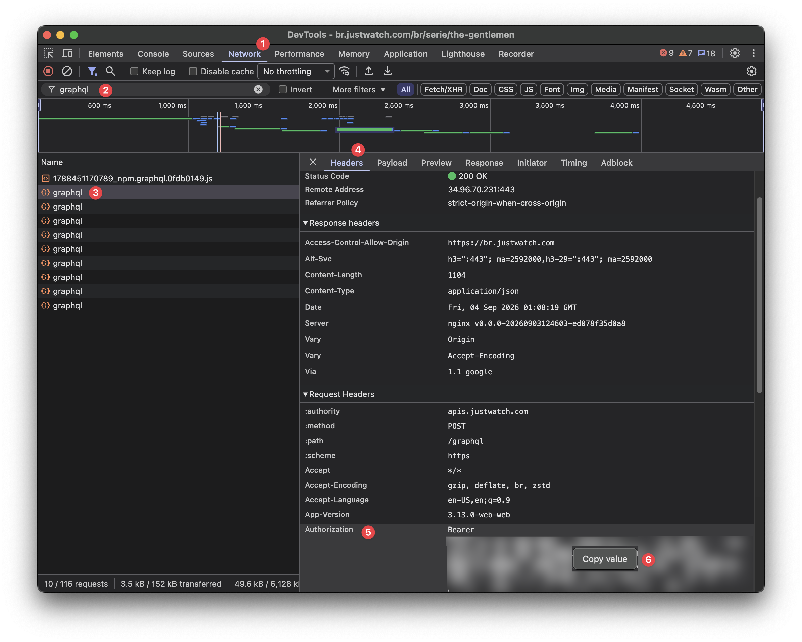

# Import your IMDb watchlist and ratings to your [JustWatch](https://www.justwatch.com) account

This script helps you import your IMDb watchlist and ratings into your JustWatch account. Your ratings can be imported both as a seenlist and, optionally, as likes/dislikes.


### Prerequisites:
*   An IMDb account (where your watchlist and ratings are).
*   A JustWatch account (where you want to import your lists).
*   **`uv`:** A fast Python project manager that handles Python installation, virtual environments, and dependencies automatically. Installation instructions: [uv documentation](https://docs.astral.sh/uv/getting-started/installation/).
*   Git (a tool for downloading code from services like GitHub).


### Setup:

1.  **Get the Script Files (Clone the Repository):**
    Open a terminal or command prompt and run:
    ```bash
    git clone https://github.com/vinismarques/imdb-to-justwatch
    cd imdb-to-justwatch # Go into the folder that was created
    ```

2.  **Install Dependencies:**
    In your terminal, from the `imdb-to-justwatch` project directory, run:
    ```bash
    uv sync
    ```
    This will download and set up everything the scripts need to run.

3.  **Prepare Your IMDb Export Files:**
    You need to download two files from your IMDb account: one for your watchlist and one for your ratings (which we'll use as a "seenlist").

    *   **Download Your IMDb Watchlist:**
        a.  Go to your IMDb Watchlist page (you can usually find this by logging into IMDb, clicking your profile name, and selecting "Your Watchlist").
        b.  Scroll all the way to the bottom of your watchlist page.
        c.  Click the "Export this list" link.
        d.  Save the downloaded file directly into the `exports/` folder.
        e.  **Crucially, rename this file to `watchlist.csv`**.

    *   **Download Your IMDb Ratings (for Seenlist):**
        a.  Go to your IMDb Ratings page (log into IMDb, click your profile name, then "Your Ratings").
        b.  Look for a menu with three dots (⋮) or an "options" button, usually near the top of the ratings list. Click it.
        c.  Select "Export" from the menu.
        d.  Save the downloaded file directly into the `exports/` folder.
        e.  **Crucially, rename this file to `ratings.csv`**.

    After these steps, your `exports/` folder should contain `watchlist.csv` and `ratings.csv`.

4.  **Get Your JustWatch Authorization Token:**
    This token allows the script to act on your behalf on JustWatch (like adding movies to your lists).

    *   Go to [JustWatch](https://www.justwatch.com/) and log in to your account.
    *   Open your browser's **Developer Tools**, by pressing `F12` or by right-clicking the page and selecting "Inspect".
    *   Open the **Network** tab (1) and type `graphql` in the filter box (2).
    *   Perform any action that requires you to be logged in, such as adding a movie to your JustWatch watchlist. Requests named `graphql` will appear in the list.
    *   Click one of them (3), open the **Headers** tab (4), and scroll down to **Request Headers**.
    *   Right-click the `Authorization` value (5) and choose **Copy value** (6). It starts with `Bearer ` and is much longer than the box shows, which is why copying by hand often truncates it.

    

    *The token is blurred in this screenshot. Treat yours like a password.*

5.  **Tell the Script Your Authorization Token:**
    The easiest way is to create a file named `.env` in the `imdb-to-justwatch` folder containing one line:

    ```
    JUSTWATCH_AUTH_TOKEN=Bearer eyJ...your...token...here
    ```

    The scripts read this file automatically, so unlike the environment variable below it survives closing your terminal. It is already listed in `.gitignore`, so it won't be committed. Never share it.

    <details>
    <summary>Prefer an environment variable instead?</summary>

    Set it in the same terminal window where you run the scripts. It usually only lasts for that session.

    <details>
    <summary>macOS / Linux</summary>

    Replace `Bearer eyJ...your...token...here` with the actual token you copied:
    ```bash
    export JUSTWATCH_AUTH_TOKEN="Bearer eyJ...your...token...here"
    ```
    </details>

    <details>
    <summary>Windows</summary>

    Replace `Bearer eyJ...your...token...here` with the actual token you copied:

    *   **Command Prompt:**
        ```cmd
        set JUSTWATCH_AUTH_TOKEN=Bearer eyJ...your...token...here
        ```
    *   **PowerShell:**
        ```powershell
        $env:JUSTWATCH_AUTH_TOKEN="Bearer eyJ...your...token...here"
        ```
    </details>
    </details>


### Running the Importers:

Make sure you have:
1.  Placed your `watchlist.csv` and/or `ratings.csv` in the `exports/` folder.
2.  Created your `.env` file with `JUSTWATCH_AUTH_TOKEN` (or set the environment variable in this terminal session).

*   **To import your IMDb Watchlist to JustWatch:**
    Run the following command in your terminal (from the `imdb-to-justwatch` directory):
    ```bash
    uv run import_watchlist.py
    ```

*   **To import your IMDb Ratings (as a Seenlist) to JustWatch:**
    Run the following command in your terminal (from the `imdb-to-justwatch` directory):
    ```bash
    uv run import_seenlist.py
    ```

*   **To like/dislike titles on JustWatch based on your IMDb Ratings:**
    Run the following command in your terminal (from the `imdb-to-justwatch` directory):
    ```bash
    uv run import_likelist.py
    ```
    This reads the `Your Rating` column (1-10) from the same `ratings.csv` and gives each title a thumbs up or down on JustWatch: ratings of **7 or higher** are liked, **4 or lower** are disliked, and everything in between (or unrated) is skipped. Adjust `LIKE_MIN_RATING` / `DISLIKE_MAX_RATING` in `import_likelist.py` to change the thresholds.

*   **To preview a run without changing your account:**
    Add `--dry-run` to any of the three commands, e.g.:
    ```bash
    uv run import_likelist.py --dry-run
    ```
    Every title is still looked up on JustWatch, so you can check what each one matched and which ones weren't found, but nothing is added, liked, or disliked. Worth doing first: a wrong match is easier to catch here than to undo later.

The scripts show progress as they go, and nothing depends on you copying the terminal output before closing it:

*   `logs/<script>-<timestamp>.log`: the full log of the run.
*   `logs/<script>-unmatched-<timestamp>.csv`: written only when something needs you. It lists every title that was skipped or failed, with the reason. These are the ones to add to JustWatch by hand.


### If something goes wrong:

*   **"JustWatch rejected the token (401)"**: the token is wrong, expired, or was pasted with the surrounding quotes. Log in to JustWatch again and copy a fresh one, as tokens are short-lived. The run stops immediately rather than failing on every title.
*   **"JUSTWATCH_AUTH_TOKEN contains non-ASCII characters"**: your browser truncated the token with an ellipsis (`…`). Right-click the `Authorization` field and choose "Copy value" instead of selecting the text.
*   **"Could not find X on JustWatch"**: JustWatch has no match under that title, or lists it under a different name. These are collected in `logs/*-unmatched-*.csv` so you can add them by hand.
*   **"Unsupported IMDb title type"**: only movies and series are imported. Episodes, video games and similar entries are skipped, and also land in the unmatched report.
*   **The counts on the JustWatch website look wrong**: the site sometimes serves a stale count. Adding and then removing any single title forces it to refresh.
*   **A title was matched to the wrong film**: please open an Issue with the IMDb title and year. Running with `--dry-run` first catches these before they reach your account.


### Notes:
*   The scripts have a built-in delay between actions to be kind to the JustWatch servers and avoid being blocked.
*   **API Usage:** The JustWatch APIs used by this script are internal. While generally safe for personal, limited use (like importing your lists), they are not officially public or documented for third-party commercial use. Please use responsibly.
*   Websites like IMDb and JustWatch sometimes change how their pages or export files are structured. If the scripts stop working, it might be because of such a change. Please open an Issue in GitHub if you think that is the case.
*   **Keep your `JUSTWATCH_AUTH_TOKEN` private!** It's like a password for your JustWatch account. Don't share it publicly. The environment variable method helps keep it more secure than typing it directly into the script.
*   **Inspiration:** This project was inspired by the work done by @prasanth-G24 in the [Imdb_to_JustWatch](https://github.com/prasanth-G24/Imdb_to_JustWatch) repository.
